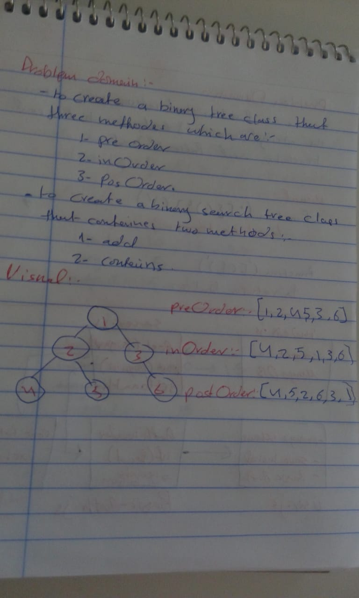

# Code Challenge 15

## Code Challenge: Binary Tree and BST Implementation

## Challenge Summary
to create a binary tree class that has three methodes which are :
- postOrder()
- inOrder()
- preOrder()

to create a binary search tree class that has two methods :
- add()
- contains()

## bigO
 the binary tree methods : O(n) becuase there will be iteration through the nodes 

 ## Whiteboard 
 