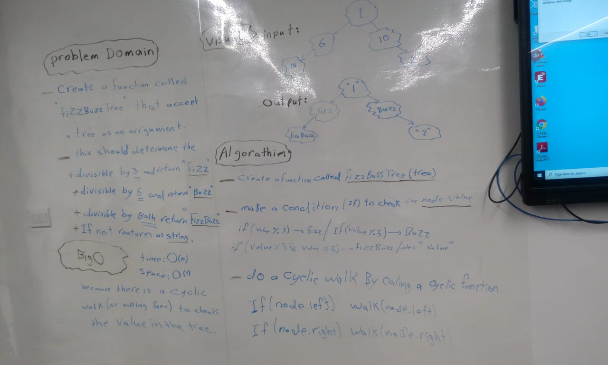

# Code Challenge 16
## Code Challenge: fizz buzz tree

## Challenge Summary
The challnge test each value of the tree to change them into Fizz, Buzz, or FizzBuzz

* If the value is divisible by 3, replace the value with “Fizz”
* If the value is divisible by 5, replace the value with “Buzz”
* If the value is divisible by 3 and 5, replace the value with “FizzBuzz”

## Approach & Efficiency
This method takes Big O(n)

## Whiteboard

