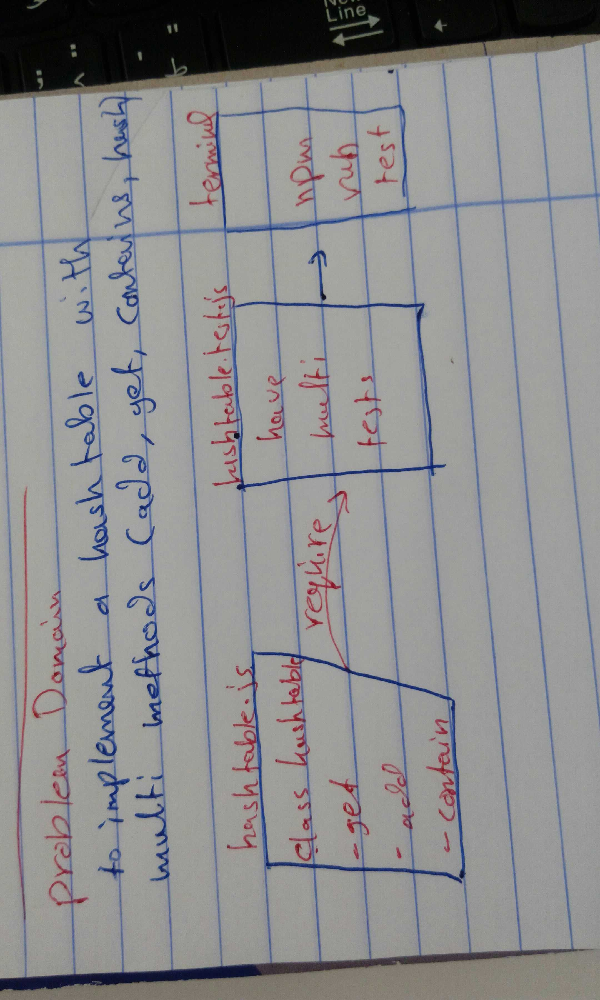

# Code Challenge 30

## Code Challenge: Hash Tables

## Challenge Summary
To implement a hashtable with multi methods:
* **add**: takes in both the key and value. This method should hash the key, and add the key and value pair to the table, handling collisions as needed.
* **get**: takes in the key and returns the value from the table.
* **contains**: takes in the key and returns a boolean, indicating if the key exists in the table already.
* **hash**: takes in an arbitrary key and returns an index in the collection.

## bigO
it is a O(1) complixity

 ## Whiteboard 
 

