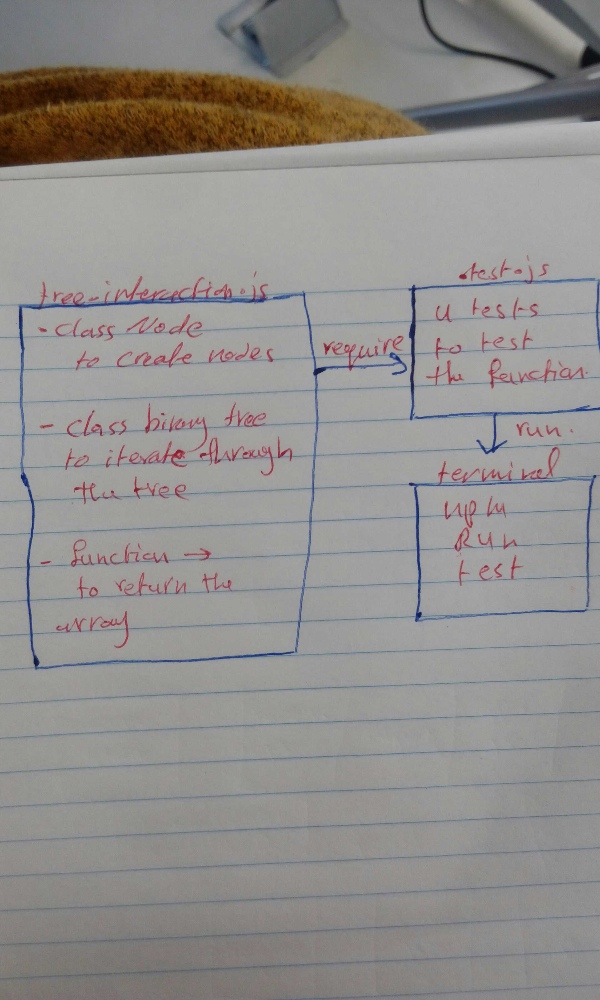

# Code Challenge 32

## Code Challenge: Tree-Intersection

## Challenge Summary
To write a function that accepts tow binary trees and return a set of values found in both trees.

## Big(O)
- Big(o) of time = O(n) => the function shoud iterate through the trees to read the values
- Big(o) of space = O(1) => no new memory will be allocated.

 ## Whiteboard 
 

