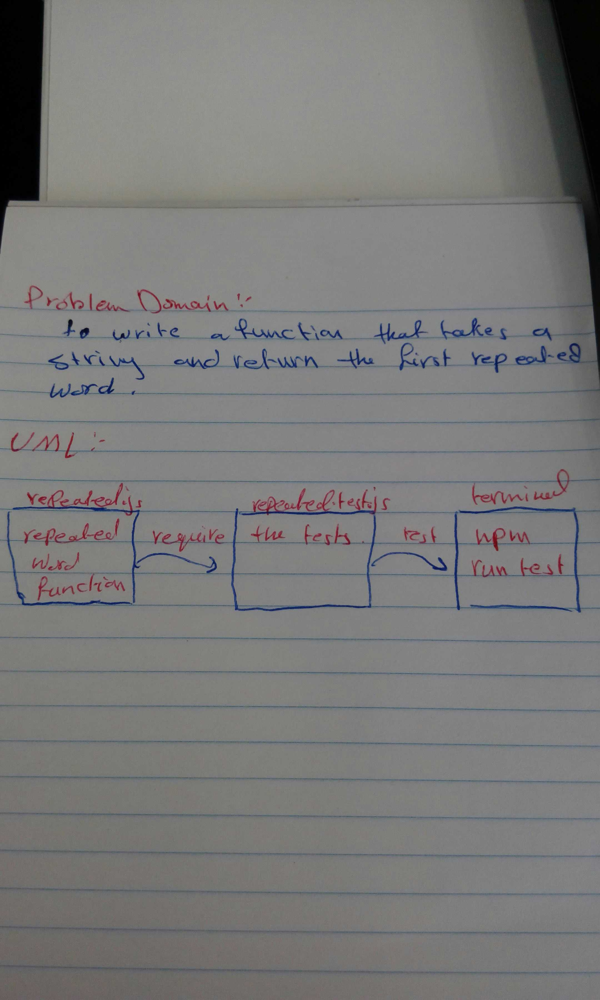

# Code Challenge 31

## Code Challenge: Repeated word

## Challenge Summary
To write a function that accepts a lengthy string parameter and return the first word to occur more than once in that provided string.

 ## Whiteboard 
 

