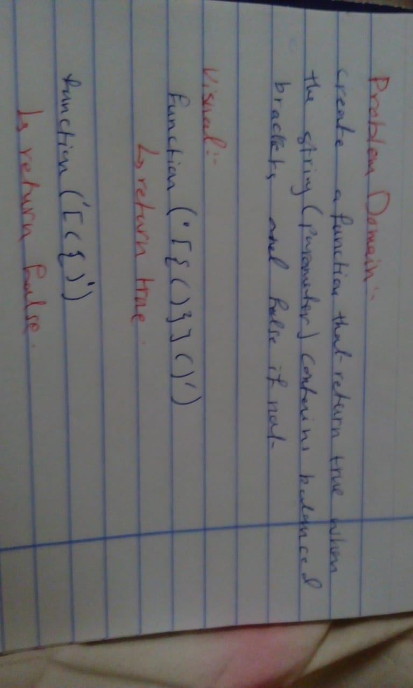

# Code Challenge 12

## Code Challenge: Multi bracket validation

## Challenge Summary
the function should take a string as its only argument, and should return a boolean representing whether or not the brackets in the string are balanced. 

## Challenge Description
There are 3 types of brackets:

Round Brackets : () 

true Square Brackets : [] 

 true Curly Brackets : {}

 and the function should return true the brackets are balanced whithin a string.

 ## Whiteboard 
 